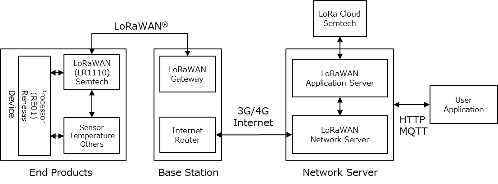

# zero-carbon-tracker
The reference design for Zero Carbon Tracker.

本サイトは、以下の目的でリファレンスデザインを公開しています。

* 顧客価値が変化・多様化する中、スピーディかつ柔軟な開発スタイルを支援します。
* 近年の製品開発で、ハードウェアーのみならずソフトウェアーの重要性が求められるケースを支援します。
* ときには専門外の領域を扱わなければならないケースもあります。特に高周波部や通信回路のデザインとベースバンド部や制御回路では、設計思想やデザインルールが異なり検討課題も多岐にわたります。その際に役立つ情報源として、スピーディかつ柔軟なアジャイル開発を有効化し、効率的なビジネスの発展を支援します。

（注）本サイトに掲載されるリファレンスデザインは、製品及び設計を保証するものではありません。

## Zero Carbon Solution
Zero Carbon Solution とは、LoRaWANを活用したカーボンニュートラルの実現を目指したソリューションです。
端末のエネルギー効率を最適化する事はもとより、通信やサーバーなどの最適化によるネットゼロを目指します。

## Zero Carbon Tracker
本サイトでは以下のファイルを公開しています。

### リファレンス回路図
ゼロカーボンソリューションを活用するための基本設計回路です。 [CD-8084001-ZCI_211007.pdf](https://github.com/Ryoden/zero-carbon-tracker/raw/main/files/CD-8084001-ZCI_211007.pdf)

* RF部は、Semtech製LR1110を搭載し、LoRa＠通信及びGNNS、WiFiスキャンを可能にする高周波デザイン。
* ベースバンド部はルネサスエレクトロニクス製RE01マイコン（超低消費マイコン）を搭載し、エネルギーハーベストシステム及び低消費電力制御によるゼロカーボンデザイン。

### リファレンスBOMリスト
ゼロカーボンソリューションを実現する基本設計回路の部品リストです。 [BM-8084001-ZCI_211012.xlsx](https://github.com/Ryoden/zero-carbon-tracker/raw/main/files/BM-8084001-ZCI_211012.xlsx)

* 主要部品：Semtech製LR111　ルネサスエレクトロニクス製RE01マイコン

### リファレンス基板デザイン
ゼロカーボンソリューションのリファレンス回路図を具現化する基板デザインです。 [PC-8084001_ZCI_211007.pdf](https://github.com/Ryoden/zero-carbon-tracker/raw/main/files/PC-8084001_ZCI_211007.pdf)

* センシング回路、高周波マッチング回路、電源制御回路、をコンパクトに基板化するデザイン

## 免責事項

* 本サイトで公開している各種のリファレンスデザインの設計データ（以下、設計データ）のご使用は自己責任でお願いいたします。
* 設計データの使用で発生したいかなる問題についても、弊社および部品メーカーでは一切の責任を負いかねますことをご了承下さい。
* これら設計データは、部品メーカーのご協力のもと作成し公開しております。
* 設計データについてのご意見お問い合わせについては、GitHubサイト上のコミュニティーでメンバーの可能な範囲で対応するものとします。
* 部品メーカーでは対応致しかねます事をご了承願います。
* 設計データは試作設計や技術評価用に用いる事を想定しております。
* 製品設計に用いる場合は充分なご検討の上、自己責任でご使用願います。
* 設計データは予告なく変更・削除される場合がございます。
* 設計データの転載・２次使用等につきましては、[こちら](https://github.com/Ryoden/zero-carbon-tracker/issues) でお問い合わせください。

## Feedback
本サイトに関するご意見、不具合などは [こちら](https://github.com/Ryoden/zero-carbon-tracker/issues) 。
